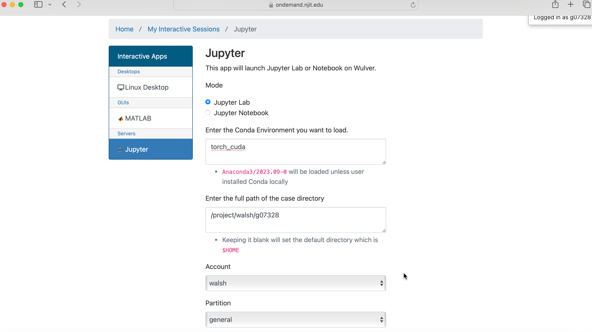
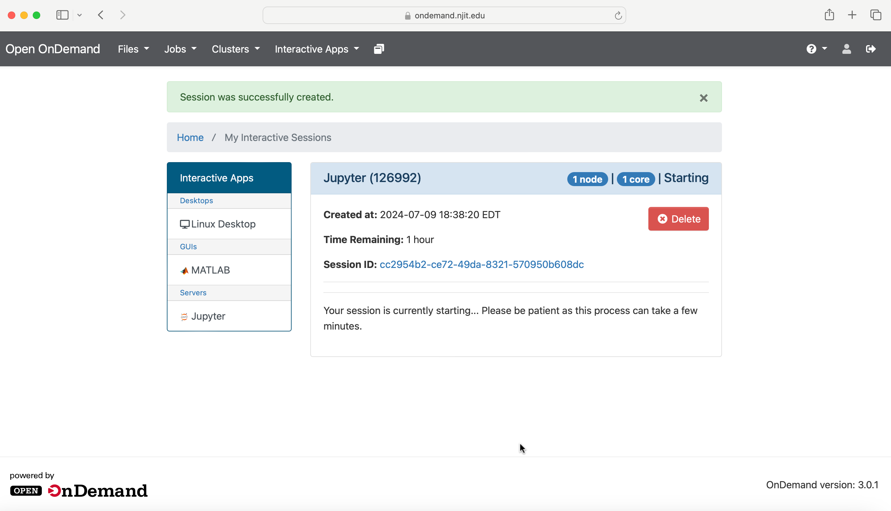

# Jupyter

## Launching Jupyter Session

* Navigate to the Interactive Apps section.
* Select `Jupyter` from the list of available applications.

## Loading the Environment 

* Choose the `Mode` option, where you can select the interface:
    - Jupyterlab 
    - Jupyter Notebook

* In the `Conda Environment` section, mention the environment name where you have installed Jupyter Notebook or Jupyterlab. For example, if the name of the environment is `torch_cuda`, then just type `torch_cuda` in the box. If you don't know how to install Jupyter Notebook or Jupyterlab in the Conda environment, check [Conda Documentation](conda.md) and [Jupyter Installation](jupyter.md).

* Choose the path where you want to start the Jupyter session in `Enter the full path of the case directory`. For session in `$HOME` directory keep this blank. 

{ width=60% height=60%}

## Configuring Resources

* Specify your Slurm account/partition/qos.
* Set the maximum wall time requested.
* Choose the number of cores you need.
* If required, specify the number of GPUs.

{ width=60% height=60%}

{ width=60% height=60%}

## Launching the Session

Select the `Launch` option after finalizing the resources. Once clicking **Launch**, the request will be queued, and when resources have been allocated, you will be presented with the option to connect to the session by clicking on the blue `Connect to Jupyter` option.

{ width=60% height=60%}

{ width=60% height=60%}

