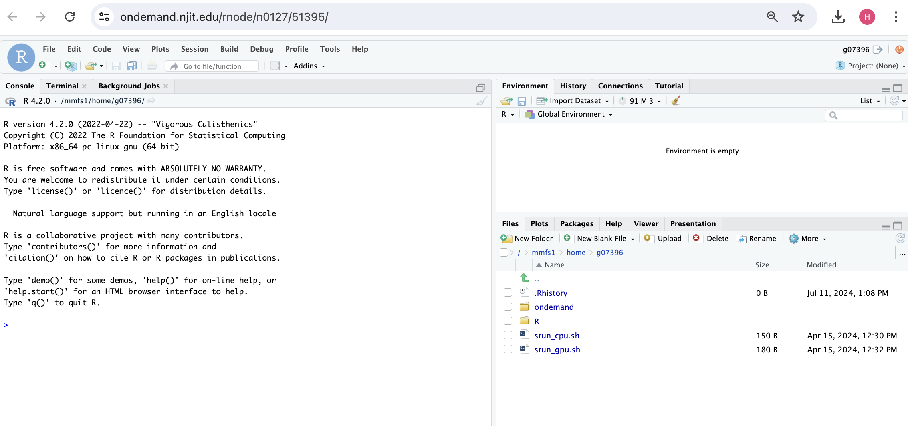

# RStudio

## Launching RStudio

* Navigate to the Interactive Apps section.
* Select `RStudio` from the list of available applications.

## Loading the R Environment

* By default, `R 4.2.2` is loaded. If you want to use this version, you can proceed without any additional commands.
* To use a different version or environment, enter the necessary commands:
For example, to use a Conda environment, enter:
`module load Anaconda3/2023.09-0; source conda.sh; conda activate my_conda_r_env`
* To use a different R environment, enter the following commands: `module load GCC/11.2.0 OpenMPI/4.1.1 R/4.2.0`

{ width=50% height=50%}

## Configuring Resources

* Specify your Slurm account/partition/qos.
* Set the maximum wall time requested.
* Choose the number of cores you need.
* If required, specify the number of GPUs.

## Launching the Session

{ width=50% height=50%}

Once clicking **Launch**, the request will be queued, and when resources have been allocated, you will be presented with the option to connect to the session by clicking on the blue Connect to R Studio Server button.
{ width=50% height=50%}

{ width=50% height=50%}

{ width=50% height=50%}

Once connected, the familiar R Studio interface is presented, and you will be able to use the allocated resources, and access your research data located on Wulver.
Installing packages
It's likely your scripts will require additional R libraries; these can be installed using the `install.packages()` command in the console window of R Studio. 

## Exiting the session
If a session exceeds the requested running time, it will be killed. You may receive a message "The previous R session was abnormally terminated...". Click OK to acknowledge the message and continue. To avoid this message, it's good practice to exit the session cleanly when you have finished.
To cleanly exit R Studio, click `File -> Quit Session...` and then release resources back to the cluster queues by clicking the red Delete button for the relevant session on the My Interactive Sessions page.

Check the following recording below.

<video src="../../../assets/ondemand/ScreenRecording_Rstudio.mov" controls>
  Your browser does not support the video tag.
</video>

