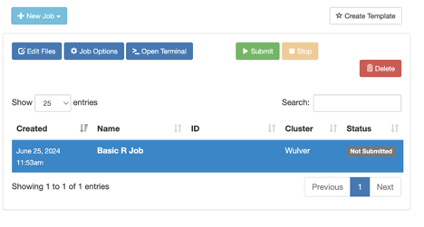
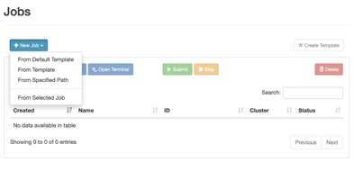
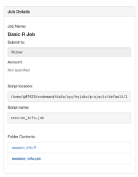
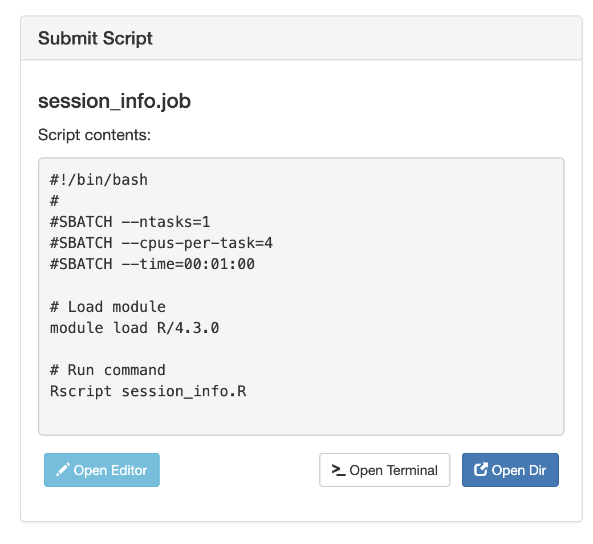

# Open OnDemand

## Overview

Open OnDemand is now available for NJIT HPC access at [ondemand.njit.edu](https://ondemand.njit.edu)!

[Open OnDemand](https://openondemand.org/) is a browser-based gateway to NJIT's Wulver cluster and shared storage. It offers a graphical interface allowing users to view, edit, download, and upload files. Users can manage and create job templates for the cluster and access interactive applications such as remote desktops to cluster nodes. Additionally, Open OnDemand supports GUI-based software like Jupyter Lab/Notebook, Matlab, and RStudio, all accessible through a web browser on virtually any device. No additional software installation is necessary, and users can operate with minimal Linux and job scheduler command knowledge.

This is an [open source](https://openondemand.org/) project developed through NSF funding.

## Features

* Easy to use
* Great for researchers and students new to HPC
* Convenient for experienced users as well

## Using OnDemand

### Logging into OnDemand

If you have access to the Wulver cluster, you can use OnDemand. Open any browser and go to ondemand.njit.edu. Use your UCID and password to log in. If you are off campus, you will need to set up VPN to access the platform.

### Dashboard

Once you log in, you will see the OnDemand Dashboard. You will see the menu bar on the top where you can access all the tools available including Files Manager, Shell Access, Job Composer, and Interactive Apps. You will also see several pinned apps highlighted on the Dashboard.

### Files

{ width=60% height=60%}

The File Manager tool is available under ‘Files’ from the Dashboard. Here you can view, edit, and transfer files between your local computer and the cluster. You can access any of the shared filesystems on Wulver including your `$HOME` directory as well as Project, Research, and Scratch. This graphical interface makes it easy to navigate your directories and transfer files to the cluster. (This transfer is only for small files such as job scripts or input scripts, please use command line tools, such as [rsync](https://linux.die.net/man/1/rsync) for larger datasets).

Use the <kbd>Upload</kbd> and <kbd>Download</kbd> buttons to transfer files between your local computer and the cluster. You can navigate to any of your directories through the <kbd>Change Directory</kbd> button where you can enter the path for your desired location. You can also create new folders with the <kbd>New Directory</kbd> button.

### Jobs

The Jobs menu on the menu bar includes both the Job Composer and the Active Jobs tools. The Job Composer assists you to set up and submit jobs to the cluster through a graphical interface using file management tools and access to job templates. 

### Job Composer

{ width=60% height=60%}

### Active Jobs

The Active Jobs tool will allow you to view all the jobs you’ve submitted that are currently in the queue, via OnDemand or not, so you can check on their status.   
{ width=60% height=60%}

{ width=50% height=50%}

{ width=50% height=50%}