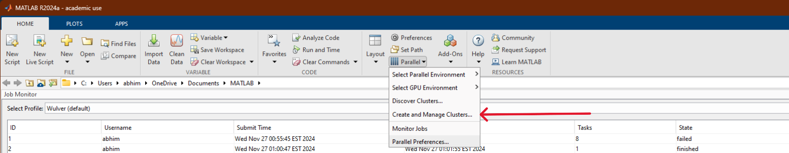
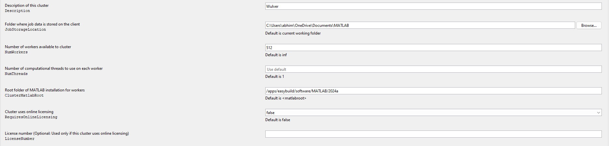
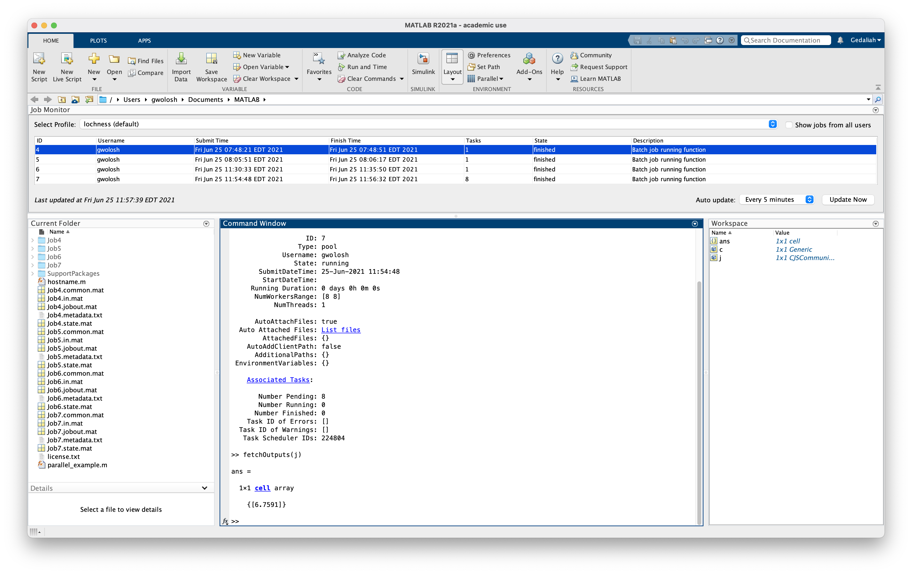

# Use MATLAB on NJIT HPC

!!! warning
    
    Please note that since MFA is enabled, the instructions for running MATLAB via HPC resources have been modified. If you already installed MATLAB on the local machine, skip to [Setup Slurm profile to run MATLAB on Wulver](matlab_local.md#setup-slurm-profile-to-run-matlab-on-wulver). 

## Installation steps of MATLAB on local machine
* Go to [Mathworks Download](https://www.mathworks.com/downloads/) and register with your NJIT email address.
* Select the [MATLAB version](../#availability) installed on Wulver.
* User needs to select the correct installer based on the OS (Mac or Windows). 
* Run the installer.

   { width=50% height=50%}
   { width=50% height=50%}

* Make sure to check **Parallel Computing Toolbox** option.
   
   {width=50% height=50%}

* Continue by selecting **Next** and MATLAB will be installed on your computer.

## Setup Slurm profile to run MATLAB on Wulver
* Open MATLAB --> select <kbd>Create and Manage Clusters</kbd>.

{ width=50% height 50%}

* A new dialogue box will open and under the <kbd>Add Cluster Profile</kbd>, select <kbd>Slurm</kbd>.

{ width=50% height 50%}

{ width=50% height 50%}

* This will open a Slurm cluster Profile and select the <kbd>edit</kbd> option to modify the parameters

{ width=50% height 50%}

* Modify the following parameters as mentioned in the screenshot



a. `Description` - Set the name as `Wulver`

b. `JobStorageLocation` - No Change

c. `NumWorkers` - 512

d. `NumThreads` - No Change

e. `ClusterMatlabRoot` - Use `module av MATLAB` command first.

```bash
  login-1-45 ~ >: module av MATLAB
  ------------------------------------/apps/easybuild/modules/all/Core---------------------------------------------------------
   MATLAB/2024a

Use "module spider" to find all possible modules and extensions.
Use "module keyword key1 key2 ..." to search for all possible modules matching any of the "keys".
```
This will show you the list of MATLAB versions installed on Wulver. Next, use `module show MATLAB/2024a` to check MATLAB installation path.

```bash
   login-1-45 ~ >: module show MATLAB/2024a
---------------------------------------------------------------------------------------------------------------------------------
   /apps/easybuild/modules/all/Core/MATLAB/2024a.lua:
---------------------------------------------------------------------------------------------------------------------------------
help([[
Description
===========
The MATLAB Parallel Server Toolbox.


More information
================
 - Homepage: https://www.mathworks.com/help/matlab/matlab-engine-for-python.html
]])
whatis("Description: The MATLAB Parallel Server Toolbox.")
whatis("Homepage: https://www.mathworks.com/help/matlab/matlab-engine-for-python.html")
whatis("URL: https://www.mathworks.com/help/matlab/matlab-engine-for-python.html")
conflict("MATLAB")
prepend_path("CMAKE_PREFIX_PATH","/apps/easybuild/software/MATLAB/2024a")
prepend_path("PATH","/apps/easybuild/software/MATLAB/2024a/bin")
setenv("EBROOTMATLAB","/apps/easybuild/software/MATLAB/2024a")
setenv("EBVERSIONMATLAB","2024a")
setenv("EBDEVELMATLAB","/apps/easybuild/software/MATLAB/R2023a/easybuild/Core-MATLAB-2023a-easybuild-devel")
prepend_path("PATH","/apps/easybuild/software/MATLAB/2024a/toolbox/parallel/bin")
prepend_path("PATH","/apps/easybuild/software/MATLAB/2024a")
prepend_path("LD_LIBRARY_PATH","/apps/easybuild/software/MATLAB/2024a/runtime/glnxa64")
prepend_path("LD_LIBRARY_PATH","/apps/easybuild/software/MATLAB/2024a/bin/glnxa64")
prepend_path("LD_LIBRARY_PATH","/apps/easybuild/software/MATLAB/2024a/sys/os/glnxa64")
setenv("_JAVA_OPTIONS","-Xmx2048m")
```
The MATLAB installation path is defined by the `EBROOTMATLAB` environment variable, which, in the above example, is set to `/apps/easybuild/software/MATLAB/2024a`.

f. `RequireOnlineLicensing` - false

g. `AdditionalProperties` - Select <kbd>add</kbd>  and add the following as mentioned in the table. 


| Name                       |       Value       |  Type   |
|----------------------------|:-----------------:|:-------:|
| `ClusterHost`              | `wulver.njit.edu` | String  |
| `AuthenticationMode`       |    Multifactor    | String  |
| `UseUniqueSubfolders`      |       True        | Logical |
| `UseIdentityFile`          |       False       | Logical |
| `RemoteJobStorageLocation` |      `$PATH`      | String  |
| `user`                     |      `$UCID`      | String  |

Replace `$PATH` with the actual path of Wulver where you want to save the output file. Make sure to use `/project` directory for remote job storage as `$HOME` has fixed quota of 50GB and cannot be increased. See [Wulver Filesystems](Wulver_filesystems.md) for details. Replace `$UCID` with the NJIT UCID.


## Submitting a Serial Job
This section will demonstrate how to create a cluster object and submit a simple job to the cluster. The job will run the 'hostname' command on the node assigned to the job. The output will indicate clearly that the job ran on the cluster and not on the local computer.

The hostname.m file used in this demonstration can be downloaded [here](https://www.mathworks.com/matlabcentral/fileexchange/24096-hostname-m).

```
 >> c=parcluster 
```
 { width=70% height 70%}

Certain arguments need to be passed to SLURM in order for the job to run properly. Here we will set values for partition, and time. In the Matlab window enter:
```
 >> c.AdditionalProperties.AdditionalSubmitArgs=['--partition=general --qos=standard --account=$PI_UCID --time=2-00:00:00'] 
```
Replace `$PI_UCID` with the UCID of PI. Check the [SLURM Documentation](slurm.md) for other SLURM parameters.
To make this persistent between Matlab sessions these arguments need to be saved to the profile. In the Matlab window enter:
```
 >> c.saveProfile 
```
 { width=70% height 70%}
 
We will now submit the hostname.m function to the cluster. In the Matlab window enter the following:
```
>> j=c.batch(@hostname, 1, {}, 'AutoAddClientPath', false); 
```

* `@`: Submitting a function.

* `1`: The number of output arguments from the evaluated function.

* `{}`: Cell array of input arguments to the function. In this case empty.

* `'AutoAddClientPath', false`: The client path is not available on the cluster.


When the job is submitted, you will be prompted for your password.

To wait for the job to finish, enter the following in the Matlab window:
```
 >>j.wait
```
Finally, to get the results:
```
 >>fetchOutputs(j)
```

### Submitting a Parallel Function
The `Job Monitor` is a convenient way to monitor jobs submitted to the cluster. In the Matlab window select `Parallel` and then `Monitor Jobs`.

For more information see the Mathworks page: [Job Monitor](https://www.mathworks.com/help/parallel-computing/job-monitor.html).

Here we will submit a simple function using a "parfor" loop. The code for this example is as follows:
```
function t = parallel_example

t0 = tic;
parfor idx = 1:16
        A(idx) = idx;
        pause (2)
end

t=toc(t0);
```
To submit this job:
```
 >> j=c.batch(@parallel_example, 1, {}, 'AutoAddClientPath', false, 'Pool', 7)
```
Since this is a parallel job a 'Pool' must be started. The actual number of tasks started will be one more than requested in the pool. In this case, the batch command calls for a pool of seven. Eight tasks will be started on the cluster.

The job takes a few minutes to run and the state of the job changes to "finished."

Once again to get the results enter:
```
 >> fetchOutputs(j) 
```
As can be seen the parfor loop was completed in 6.7591 seconds.

 { width=70% height 70%}

## Submitting a Script Requiring a GPU
In this section we will submit a matlab script using a GPU. The results will be written to the job diary. The code for this example is as follows:
```
% MATLAB script that defines a random matrix and does FFT
%
% The first FFT is without a GPU
% The second is with the GPU
%
% MATLAB knows to use the GPU the second time because it
%   is passed a type gpuArray as an argument to FFT
% We do the FFT a bunch of times to make using the GPU worth it,
%   or else it spends more time offloading to the GPU
%   than performning the calculation
%
% This example is meant to provide a general understanding
%   of MATLAB GPU usage
% Meaningful performance measurements depend on many factors
%   beyond the scope of this example
% Downloaded from https://projects.ncsu.edu/hpc/Software/examples/matlab/gpu/gpu_m

% Define a matrix
A1 = rand(3000,3000);

% Just use the compute node, no GPU
tic;
% Do 1000 FFT's
for i = 1:1000
      B2 = fft(A1);
end
time1 = toc;
fprintf('%s\n',"Time to run FFT on the node:")
disp(time1);

% Use GPU
tic;
A2 = gpuArray(A1);
% Do 1000 FFT's
for i = 1:1000
      % MALAB knows to use GPU FFT because A2 is defined by gpuArray
        B2 = fft(A2);
end
time2 = toc;
fprintf('%s\n',"Time to run FFT on the GPU:")
disp(time2);

% Will be greater than 1 if GPU is faster
speedup = time1/time2 
```
We will need to change the partition to `gpu` to request a gpu. In the Matlab window enter:
```
 >> c.AdditionalProperties.AdditionalSubmitArgs=['--partition=gpu --qos=standard --account=PI_UCID --gres=gpu:1 --mem-per-cpu=4G --time=2-00:00:00'] 
```
 { width=70% height 70%}

Submit the job as before. Since a script is submitted as opposed to a function, only the name of the script is included in the batch command. Do not include the '@' symbol. In a script there are no inputs or ouptuts.
```
 >> j=c.batch('gpu', 'AutoAddClientPath', false) 
```
 
To get the result:
```
 >> j.diary 
```

## Load and Plot Results from A Job
In this section we will run a job on the cluster and then load and plot the results in the local Matlab workspace. The code for this example is as follows:
```
n=100;
disp("n = " + n);
A = gallery('poisson',n-2);
b = convn(([1,zeros(1,n-2),1]'|[1,zeros(1,n-1)]), 0.5*ones(3,3),'valid')';
x = reshape(A\b(:),n-2,n-2)';%
```
As before submit the job:
```
 >> j=c.batch('plot_demo', 'AutoAddClientPath', false);
```

To load 'x' into the local Matlab workspace:
```
 >> load(j,'x') 
```
 
 Finally, plot the results:
```
 >> plot(x) 
```

 